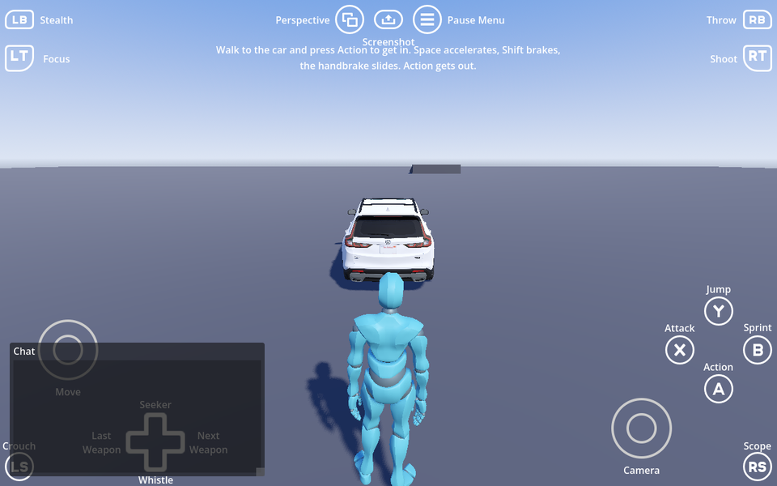

# Godot Tim's Automobile (GTA) for Godot 4.8+

Drivable vehicles with GTA V style handling: a five-speed box, traction curves, a handbrake and a
chase camera. Plus an optional car combat layer and a Twisted Metal 2 demo that plays in that game's
own Los Angeles arena, converted from the disc.

**[Read the full documentation](addons/gta/README.md)**, which ships with the addon so it is
there however you installed it.

## This repository

It uses the layout the [Godot Asset Library](https://docs.godotengine.org/en/stable/community/asset_library/submitting_to_assetlib.html) expects, so it is both the addon and a
project you can open and edit it in:

```
project.godot                 the demo project, which is this repository
addons/gta/                   the addon itself
tools/extract_tm2.py          builds the Twisted Metal 2 level from your own disc
addons/3d_player_controller/  what the demo drives around as
addons/controls/              the on-screen input hints
addons/gut/                   the test runner
```

Clone it, open `project.godot` in Godot, and run the demo scene. The addon is mounted at
`res://addons/gta/` exactly as it is in a game, so it is edited in place with nothing copied
anywhere first. Installing through the Asset Library takes `addons/` and skips the root
`project.godot` as a conflict, which is why that file can live here harmlessly.

## Installing it in a game

Copy `addons/gta/` into your project's `addons/`. See the
[addon's README](addons/gta/README.md) for what it needs and how to use it.
